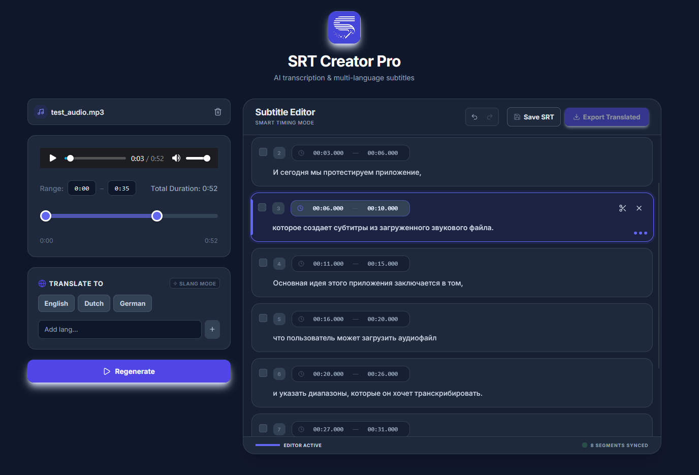

# SRT Creator Pro

**SRT Creator Pro** is a modern, AI-powered web application designed to streamline the process of creating, editing, and translating subtitles. Built with **React** and **TypeScript**, it leverages **Google's Gemini API** to provide accurate audio transcription and high-quality translations.



## ✨ Key Features

- **🤖 AI Transcription**: Instantly transcribe uploaded audio files using the Gemini Flash model.
- **📝 Professional Subtitle Editor**:
  - **Visual Timeline**: Precisely manage start and end times.
  - **Smart Editing**: Auto-cascading time adjustments to prevent overlaps.
  - **Split & Merge**: Split long segments at the cursor or merge consecutive segments with ease.
  - **Undo/Redo History**: Full support for undoing and redoing actions (`Ctrl+Z` / `Ctrl+Shift+Z`).
- **🌍 Multi-Language Translation**:
  - Translate subtitles into multiple languages simultaneously.
  - **Slang Mode**: specialized preservation of colloquialisms and tone.
  - Custom language support.
- **⚡ Real-time Playback**: Integrated audio player synchronized with your subtitle segments.
- **💾 Export to SRT**: Download compliant `.srt` files for original transcriptions or translations.

## 🛠 Tech Stack

- **Frontend**: React 19, Vite, TypeScript
- **Styling**: Tailwind CSS, Lucide React (Icons)
- **AI Integration**: Google GenAI SDK (Gemini)

## 🚀 Getting Started

### Prerequisites

- [Node.js](https://nodejs.org/) (v16 or higher)
- A valid [Google Gemini API Key](https://aistudio.google.com/app/apikey)

### Installation

1. **Clone the repository**
   ```bash
   git clone https://github.com/modus95/srt-creator.git
   cd srt-creator
   ```

2. **Install dependencies**
   ```bash
   npm install
   ```

3. **Configure Environment**
   Create a `.env.local` file in the project directory and add your key:
   ```env
   GEMINI_API_KEY=your_gemini_api_key_here
   ```

4. **Run the Development Server**
   ```bash
   npm run dev
   ```

## 🎮 Usage Guide

1. **Upload**: Click the upload area or drag and drop an audio file.
2. **Transcribe**: Click the **Transcribe** button. You can limit the range using the slider if you only need a specific section.
3. **Review & Edit**:
   - Click any text field to edit content.
   - Use the **Split** tool to divide a segment at the cursor.
   - Hold **Shift** and click to select multiple segments, then click **Merge** to combine them.
4. **Translate**: Select your target languages from the list (or add custom ones). Toggle **Slang Mode** if you want to keep the informal tone.
5. **Export**: Click **Save SRT** for the original language or **Export Translated** for other languages.

## ⌨️ Shortcuts

| Shortcut | Action |
|----------|--------|
| `Ctrl + Z` | Undo last action |
| `Ctrl + Shift + Z` | Redo action |
| `Shift + Click` | Select range of segments |

---

## 💙 Note:

This tool was built to help my son, Igor, level up his vlogging game! If you happen to be a die-hard fan of **Geometry Dash** or **Minecraft**, feel free to show him some love and subscribe to his channels on [YouTube](https://www.youtube.com/@croumb6506) and [Telegram](https://t.me/croumblegoodfrog). 🚀

Special thanks to **Google AI Studio** for the inspiration and for doing about 90% of the heavy lifting. I’m basically just here to make sure the "Save" button works! (well, almost 😉)


